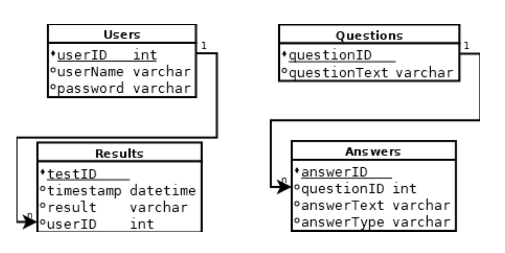

# Project Proposal: Pawsonality System

## Project Overview
The Online Test System is a web application that allows users to register, log in, and take tests by answering multiple-choice questions. The application aims to provide a seamless experience for users to assess their knowledge on various subjects. The system will record each user's tests, enabling them to see past test results.

## MVP Features
1. User Registration
   - Users can create an account by providing a username and password.
   
2. User Login
   - Users can log in using their credentials.
   
3. Home Page
   - After logging in, users can see their test status, including past test results and scores.
   
4. Test Participation
   - Users can start or retake a test from the home page.
   
5. Answering Questions
   - Users can answer test questions by selecting from multiple-choice answers.

## ERD (Entity-Relationship Diagram)
The ERD outlines the relationships between entities in the system:

- Users
  - `userID`: Primary key
  - `userName`: Unique username
  - `password`: User password
 
- Questions
  - `questionID`: Primary key
  - `questionText`: The text of the question
 
- Answers
  - `answerID`: Primary key
  - `questionID`: Foreign key referencing `Questions`
  - `answerText`: The text of the answer
  - `answerType`: Indicates the type of answer (e.g., correct/incorrect)
 
- Results
  - `testID`: Primary key
  - `timestamp`: When the test was taken
  - `result`: User's score
  - `userID`: Foreign key referencing `Users`

## Stretch Goals
1. **User Profile**
   - Users can update their profile information and change their password.
   
2. **Question Bank Management**
   - Admin users can add, edit, or delete questions in the question bank.
   
3. **Test Analytics**
   - Users can view detailed analytics of their test performance over time.
   
4. **Multi-Language Support**
   - The application supports multiple languages for broader accessibility.
   
5. **Timer for Tests**
   - Implement a countdown timer for each test to enhance the testing experience.

6. **Leaderboard**
   - Display a leaderboard showing top-performing users.

